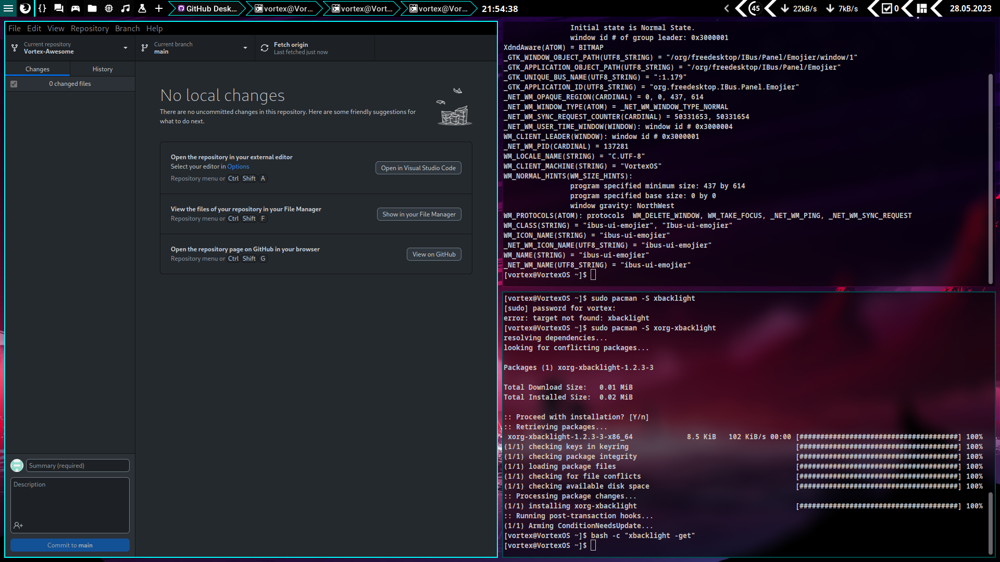
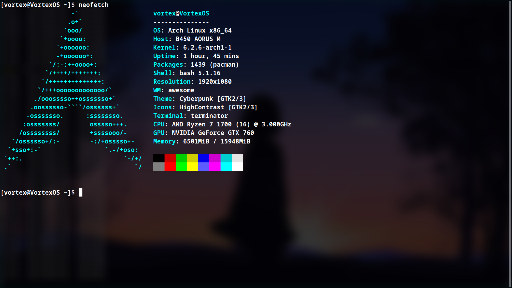
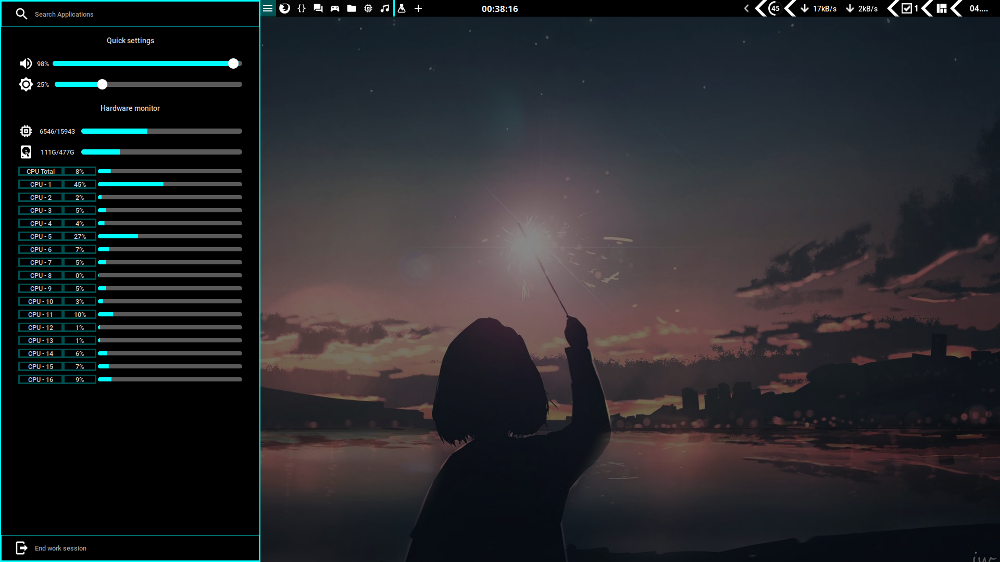
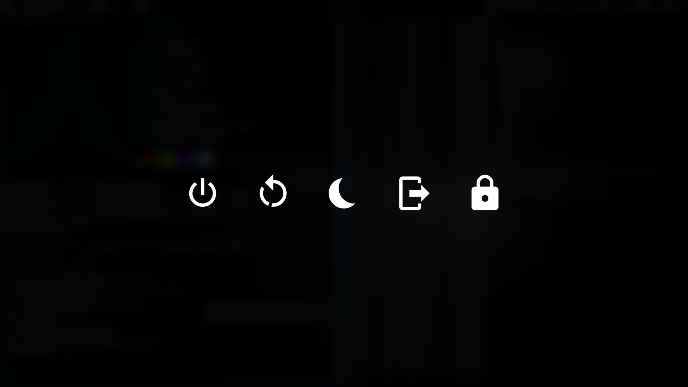

## My Vortex theme for [AwesomeWM 4.3](https://awesomewm.org/)
### Original design by [ChrisTitusTech](https://github.com/ChrisTitusTech/titus-awesome), I added my widgets and utilities to it, plus new theming.

An almost desktop environment made with [AwesomeWM](https://awesomewm.org/), focused on improving daily productivity by shortcutting many tasks.



| Fullscreen   | Side Util Panel | Exit screen   |
|:-------------:|:-------------:|:-------------:|
||||

## Installation

### 1) Get all the dependencies

#### Arch-Based

```
sudo pacman -S awesome rofi picom i3lock xclip ttf-roboto lxsession lxappearance flameshot network-manager-applet pasystray
yay -S qt5-styleplugins
```

#### Program list

- [AwesomeWM](https://awesomewm.org/) as the window manager - universal package install: awesome
- [Roboto](https://fonts.google.com/specimen/Roboto) as the **font** - Debian: fonts-roboto Arch: ttf-roboto
- [Rofi](https://github.com/DaveDavenport/rofi) for the app launcher - universal install: rofi
- [picom](https://github.com/yshui/picom) for the compositor (blur and animations) universal install: picom
- [i3lock](https://i3wm.org/i3lock/) the lockscreen application universal install: i3lock
- [xclip](https://github.com/astrand/xclip) for copying screenshots to clipboard package: xclip
- [lxsession] recommend using the lxsession as it integrates nicely for elevating programs that need root access
- [lxappearance](https://sourceforge.net/projects/lxde/files/LXAppearance/) to set up the gtk and icon theme
- [flameshot](https://flameshot.org/) my personal screenshot utility of choice, can be replaced by whichever you want, just remember to edit the apps.lua file
- [network-manager-applet](https://gitlab.gnome.org/GNOME/network-manager-applet) nm-applet is a Network Manager Tray display from GNOME.

### 2) Clone the configuration

Arch-Based Installs
```
git clone https://github.com/Vortex-Vortex/Vortex-Awesome ~/.config/awesome
```

### 3) Set the themes

Set Rofi Theme
```
mkdir -p ~/.config/rofi
cp $HOME/.config/awesome/theme/config.rasi ~/.config/rofi/config.rasi
sed -i '/@import/c\@import "'$HOME'/.config/awesome/theme/sidebar.rasi"' ~/.config/rofi/config.rasi
```

### 4) Same theme for Qt/KDE applications and GTK applications, and fix missing indicators

`qt5-styleplugins` and add this to the bottom of your `/etc/environment`

```bash
XDG_CURRENT_DESKTOP=Unity
QT_QPA_PLATFORMTHEME=gtk2
```

The first variable fixes most indicators (especially electron based ones!), the second tells Qt and KDE applications to use your gtk2 theme set through lxappearance.

### 5) Read the documentation

The documentation live within the source code.

The project is split in functional directories and in each of them there is a readme where you can get additional information about the them.

* [Configuration](./configuration) is about all the **settings** available
* [Layout](./layout) hold the **disposition** of all the widgets
* [Module](./module) contain all the **features** available
* [Theme](./theme) hold all the **aesthetic** aspects
* [Widget](./widget) contain all the **widgets** available

### TODO:

optimize widgets placements as it is probably with positions only adapted to 1920x1080 screens, otherwise it is a quite finished project, could even add some useful widgets if necessary in the future

